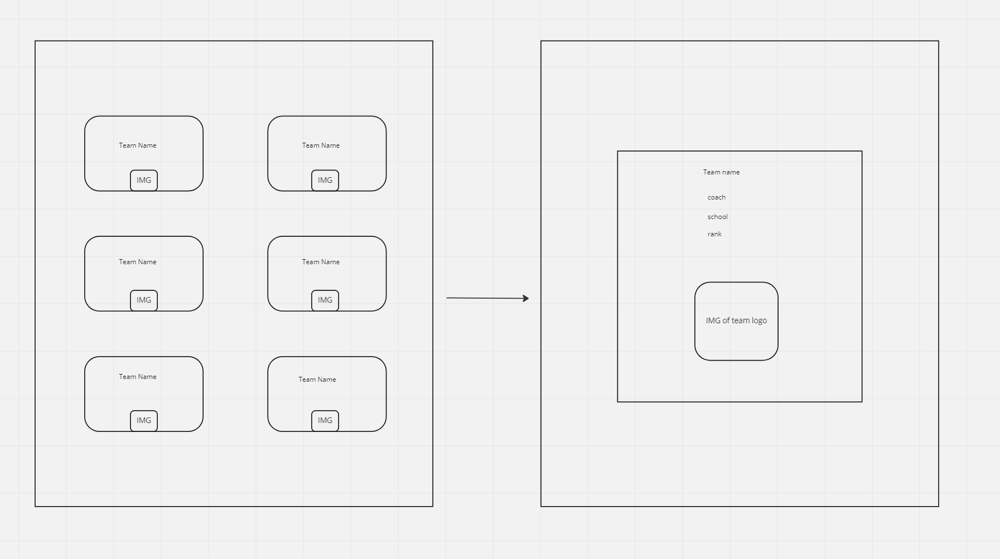

## Data Model

    -Pac-12 Football Teams
        -Name
            -Team name
            -string
        -School
            -College name
            -string
        -State
            -School state
            -int2
        -Coach
            -Name of coach
            -string
        -Ranking
            -National standing
            -int2

## HTML

    List Page
        -empty div
    Detail Page
        -empty div

## State

    Football Info
        -fetch all teams
    Football Info
        -fetch one team

## Events

    List Page on load
        -window.addEventListener(load)
        -get data from supabase
        -let data
        -loop through teams in let
        -create render function
        -create display function
    Detail Page on load
        -window.addEventListener(load)
        -get filtered team data

